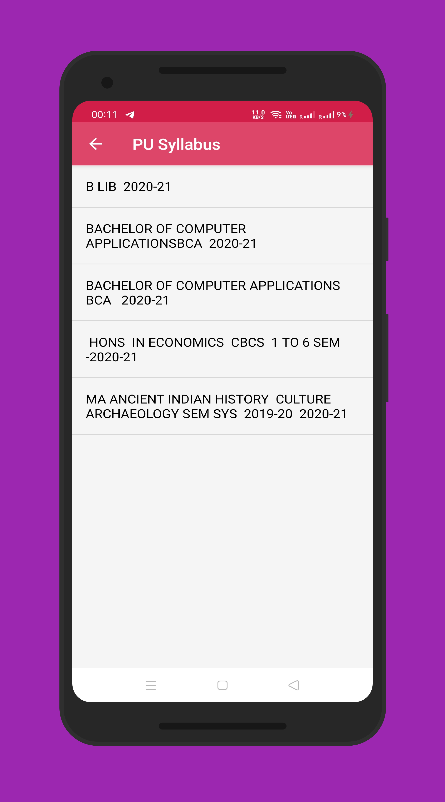
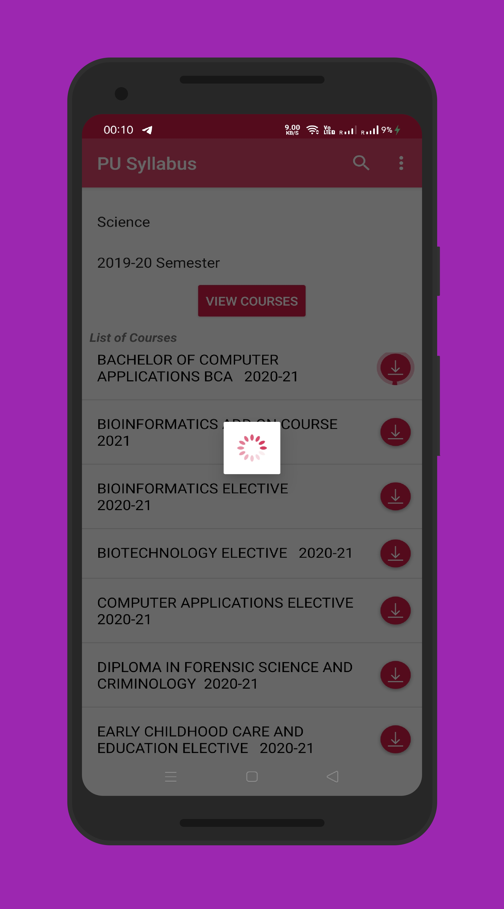
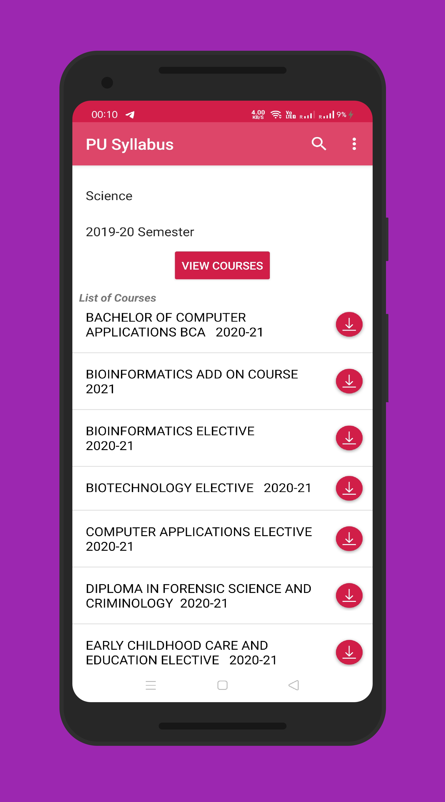
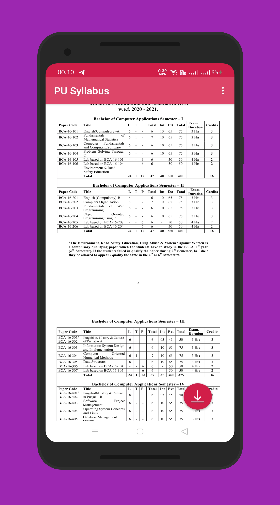
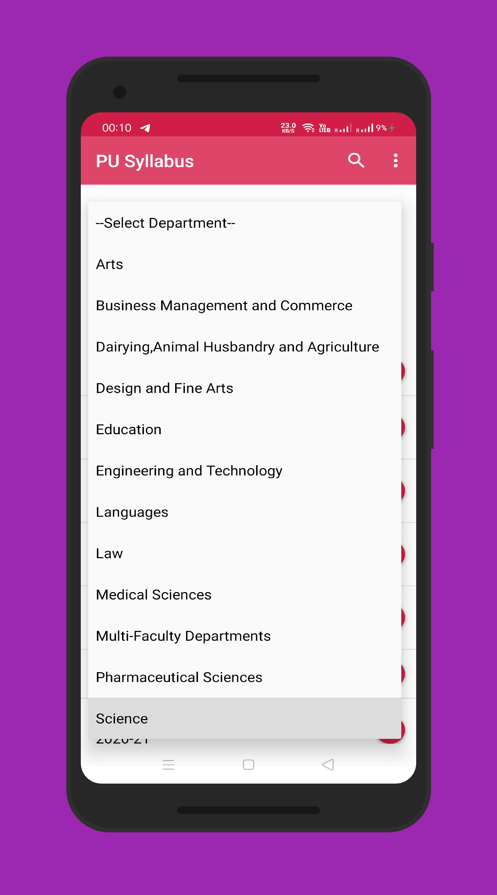

# PU Syllabus

PU Syllabus app lets you view and download syllabus of any course/degree of Punjab University.It uses HTML parsing using JSOUP library for fetching data from the university's website.

## Link of the Apk-:

https://play.google.com/store/apps/details?id=com.pusyllabus.unofficial&hl=en_IN

## Screenshots added-:
### Screenshot 1-:

### Screenshot 2-:

### Screenshot 3-:

### Screenshot 4-:

### Screenshot 5-:

### Screenshot 6-:

### Screenshot 7-:

### Screenshot 8-:

